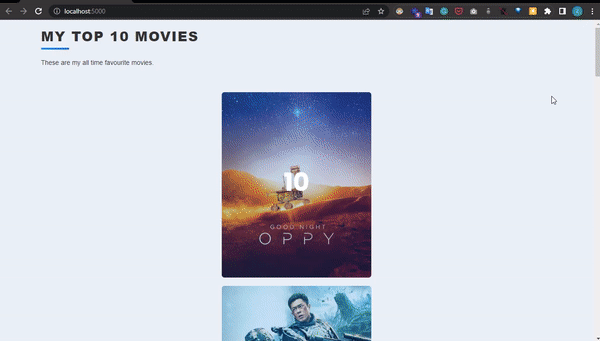

<h1 align="center"> Top 10 Movies </h1>

## About The Project:
a simple web application that allows the user to create his top 10 movies for all the time, and he can always update his list and keep track of which movies to recommend to people.

## The technologies Used:
- <a href="https://developer.mozilla.org/en-US/docs/Web/HTML">HTML5</a> & <a href="https://developer.mozilla.org/en-US/docs/Web/CSS">CSS3</a> for the structure and the styling.  
- <a href="https://getbootstrap.com/">Bootstrap 5</a> for the UI.  
- <a href="https://www.sqlite.org/index.html">SQLite</a> for the Database.  
- <a href="https://flask.palletsprojects.com/">Flask</a> for the Backend.  
- <a href="https://palletsprojects.com/p/jinja/">Jinja2</a> for the Templating.

